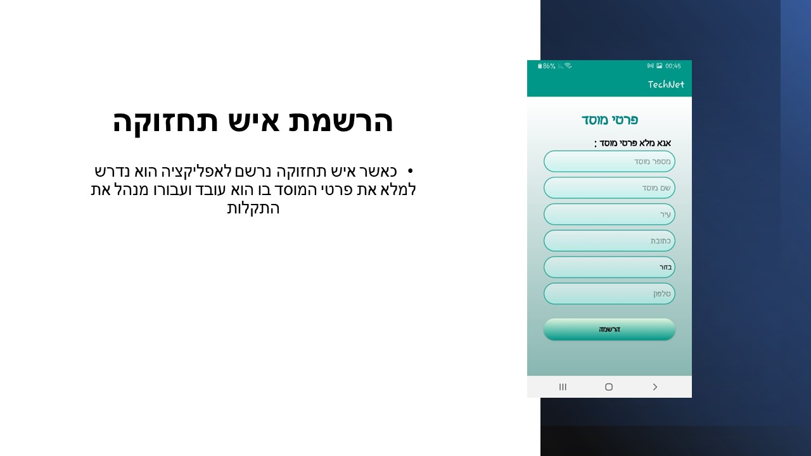
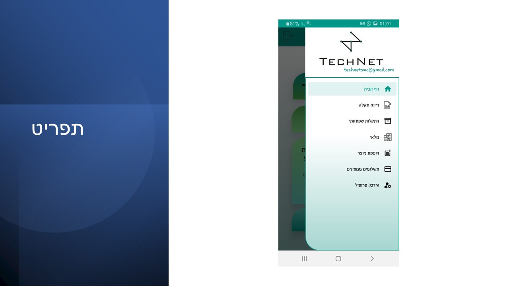
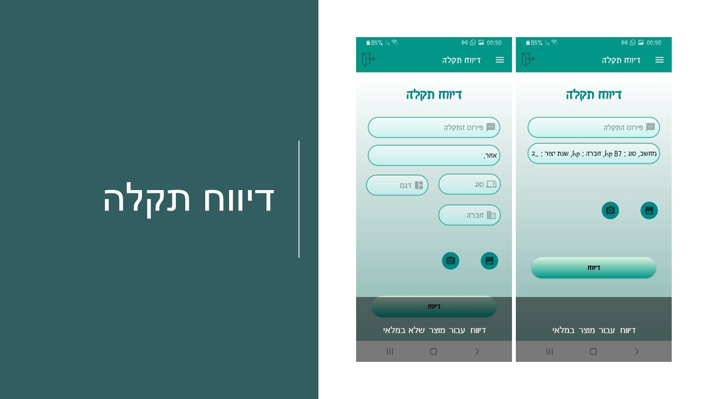
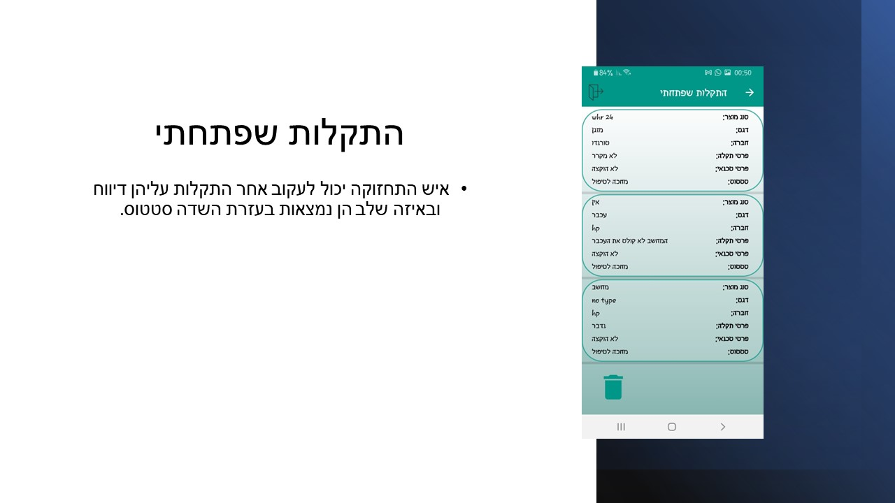
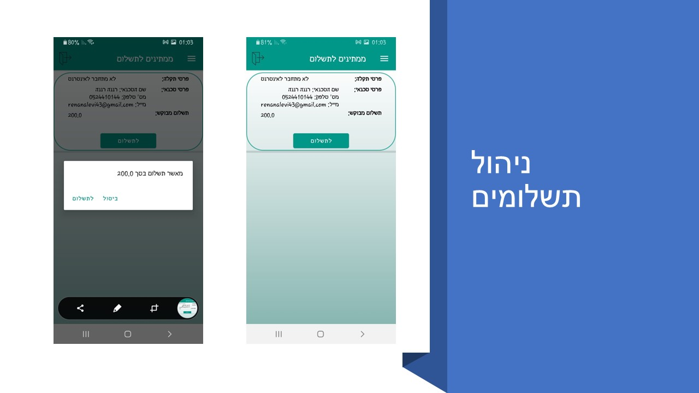
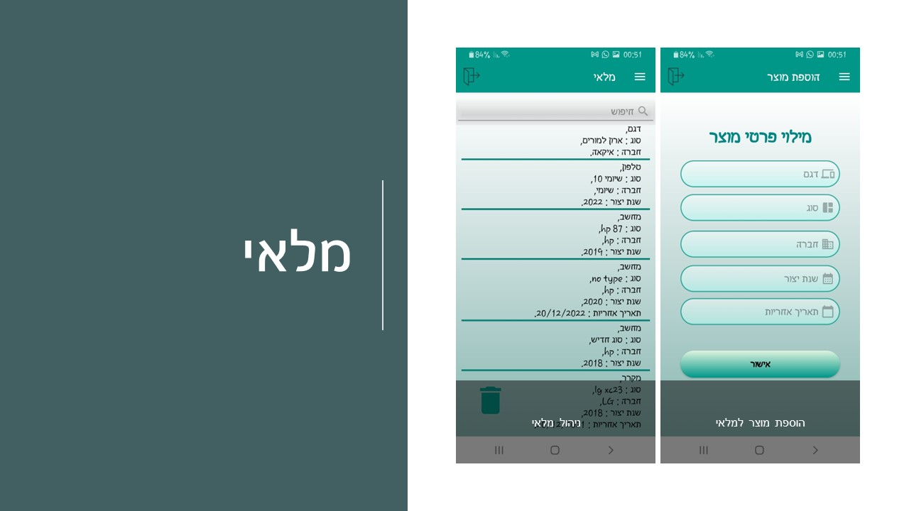
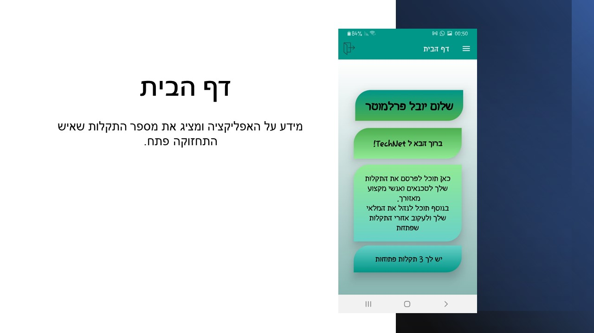
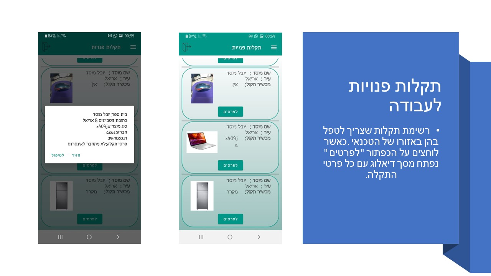
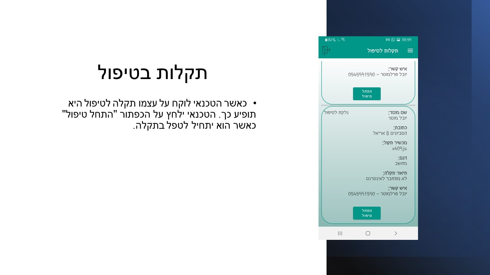
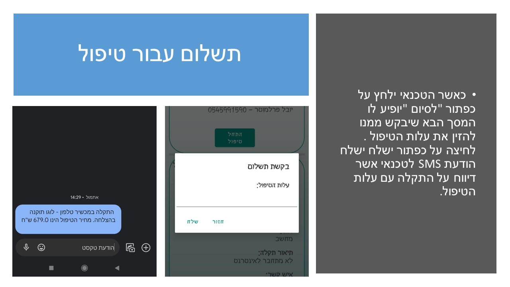

# Basic App for maintenance personnel in educational institutions
The application was written as part of a software engineering course.

## App description:
The application is meant to assist maintenance personnel in educational institutions.
With the help of the application, it will be possible to order a technician easily without the need for paperwork and bureaucracy but through the application. In addition, it will be possible to track the inventory better, and thus checking inventory will be easier and more convenient, which can also something prevent duplication of orders.

## Key requirements:
#### For the maintenance person:
- Ordering a technician through the app. (report of faults)
- Inventory management through the app. (possibility of searching by type, issuing reports, etc.)
- Ability to manage product orders automatically for employees who have joined/passed a certain time for the equipment they received, etc. (get which products you should order soon, etc.)

#### For the technician:
- Task log for the technician.
- Option to request and make a payment

#### For both:
- Convenient and clear contact methods for both parties

At the moment, the application is only in Hebrew.

## Installation:
```clone   ```
## screens
#### From the maintenance person side:

##### registration screen

##### home page

##### menu

##### report malfunction

##### malfunction opened & managing payments


##### inventory


#### From the technician side:
##### registration screen

##### available jobs (malfunctions), pressing the button will take the job

##### jobs in progress 
, pressing the button will request payment
##### payment request (fake payment, only sms)
